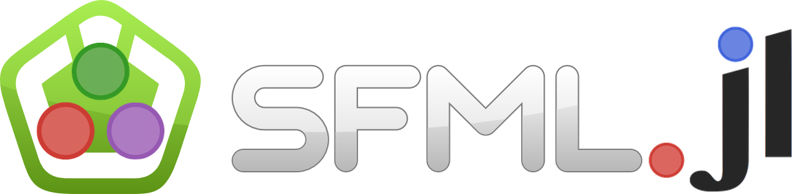

[](https://travis-ci.org/zyedidia/SFML.jl)
---
This is a binding of the C++ game and multimedia library [SFML](http://www.sfml-dev.org/) (Simple and Fast Multimedia Library), developed by Laurent Gomila, for Julia. SFML is often used for game development but it can be used for anything graphics-related.

It also has audio libraries and networking libraries.

There is currently almost complete support for graphics, great support for audio, and complete support for network.

SFML.jl works on Mac OS X, Linux, and Windows.

Take a look at the `examples` folder to see some usage examples.

For much larger examples (games) see these two examples: [Jumping Game](https://github.com/zyedidia/julia-jump-game) and [Space Shooter](https://github.com/zyedidia/SpaceShooter.jl) (this one is more complex).

You can view a talk I gave about SFML.jl at JuliaCon 2015 [here](https://www.youtube.com/watch?v=UKfM7EopMe0&feature=youtu.be&a). All the demos that I used in that talk are available in the [JuliaCon-SFML repository](https://github.com/zyedidia/JuliaCon-SFML).

# Installation

To install on any OS, run:

```
julia> Pkg.add("SFML")
```

If you want to install the master version use:

```
julia> Pkg.clone("SFML")
julia> Pkg.build("SFML")
```

### Linux
Please make sure you have Glibc 2.14 installed, and let me know if there are any build problems on Linux (I don't use Linux very much).
The Linux binaries don't come with any of the dependencies so you have to install them yourself. Here is the list:

*    pthread
*    opengl
*    xlib
*    xrandr
*    freetype
*    glew
*    jpeg
*    sndfile
*    openal

On Debian you can install the package `libsfml-dev` which will also install all dependencies. You can also run the commands [here](https://gist.github.com/NoobsArePeople2/8086528) (you don't need to install cmake-gui).

# Screenshots and Gifs

It is very simple to take a screen shot using SFML. Just use `screenshot(window, filename)`. 

You can also take a screenshot and store it in an `Image` object without saving the image using `image = capture(window)`

---

To create a gif, you must have [imagemagick](http://www.imagemagick.org/script/index.php) installed.

Making gifs is only slightly more complicated. You can use the `make_gif(window, width, height, duration, filename, delay)` function (duration and delay are in seconds). 

When you run the program, it will asynchronously create the gif and will give you constant feedback in the console. If you don't see anything in the console, add a `sleep(0)` declaration at the start of the animation loop to allow Julia time to switch between the processes.

The gif creation is done when it says `Created gif XXX.gif`.

# What has not been bound (yet)

* SoundStreams
* SoundStreamRecorders
* SFML threads (pthreads)
* Transforms

For the first three, we will probably have to wait for Julia to support multithreading.

# License

This software is a binding of the SFML library created by Laurent Gomila, which is provided under the Zlib/png license.

This software is provided under the same license as SFML, the Zlib/png license.
